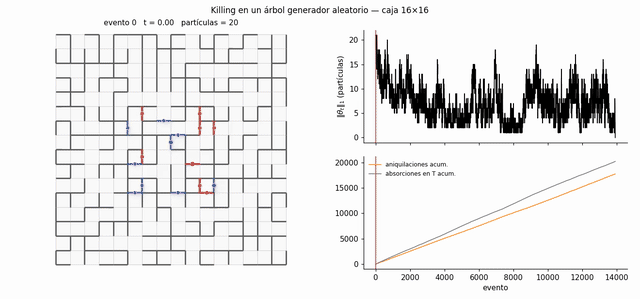
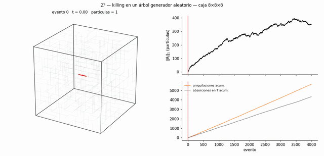

# Proceso de ramificación en complejos celulares

Simulación estocástica de un sistema de partículas con **ramificación y aniquilación** sobre el complejo cúbico $\mathbb{Z}^d$, restringido a una caja finita. Proyecto del curso **Simulación Estocástica** (Ingeniería Civil Matemática, Universidad de Chile, Primavera 2026) en conjunto con Bruno Guevara, basado en el trabajo en preparación *Branching process on complexes* de D. Cid y A. Sepúlveda.

<p align="center">
  
  
</p>

## El modelo

Una configuración $\theta \in \mathbb{Z}^{E^+}$ asigna a cada arista una cantidad entera de partículas con signo. En cada evento, una partícula sobre la arista $e$ elige una cara $f$ que la contiene: la partícula se aniquila y nacen partículas en el resto del borde de $f$,

$$\theta \longmapsto \theta - \langle e, \partial f\rangle \text{sgn}(\theta_e)\, \partial f .$$

Las partículas de signo opuesto que caen en una misma arista se aniquilan, y las que llegan a un conjunto absorbente $T$ mueren. El generador cumple $\mathcal{L} I(\theta) = -\Delta_1^{\uparrow}\theta$, donde $\Delta_1^{\uparrow}$ es el Laplaciano de Hodge superior.

## Qué hace el notebook

1. **Complejo cúbico y operadores.** Construye vértices, aristas y caras de la caja $[0,n_1]\times\cdots\times[0,n_d]$ en coordenadas dobladas (solo enteros), para cualquier dimensión $d$. Arma $\partial_1$, $\partial_2$ y $\Delta_1 = \Delta_1^{\downarrow} + \Delta_1^{\uparrow}$ como matrices dispersas (SciPy).
2. **Condiciones de absorción.** Absorción en un árbol generador (el caso del paper), en el borde de la caja o sin absorción. Incluye un árbol generador que evita la condición inicial.
3. **Motor estocástico.** Simulación exacta en tiempo continuo (algoritmo de Gillespie), con actualizaciones locales $O(1)$ y registro de la trayectoria independiente del tamaño de la caja.
4. **Configuraciones iniciales y reconstrucción** de la trayectoria a partir del proceso de alturas.
5. **Visualización** en 2D y 3D.
6. **Videos** en $\mathbb{Z}^2$ y $\mathbb{Z}^3$, y una observación sobre la meseta cuasi-estacionaria en 3D.
7. **Condición inicial: cuadrado y cubo.** Ocho escenarios que combinan la dimensión (2D o 3D), la condición inicial (unitaria o bloque de lado 3 aleatorio) y la absorción (árbol o borde de la caja).
8. **Probabilidad de extinción.** Funciones de supervivencia $\mathbb{P}(\tau>t)$ y tasas de la cola, calculadas con miles de réplicas reproducibles en paralelo (`joblib`). Se varía la condición inicial, el número de partículas, el tamaño de la caja, el conjunto absorbente, el reloj y la dimensión. **Resultado principal:** con el árbol fijo, la tasa de extinción no depende de la condición inicial y coincide con la constante de Poincaré, $\gamma(T)\approx c'(T)$ (correlación 0.95 en 40 árboles).

Las verificaciones de la teoría ($\partial\partial=0$, el drift $-\Delta^{\uparrow}\theta$, la cota de Lyapunov del Teorema 2.1 y Poincaré) y la explicación detallada del código están en el documento de explicación (PDF).

## Videos

| Video | Descripción |
|---|---|
| [`ramificacion_arbol.mp4`](videos/ramificacion_arbol.mp4) | $\mathbb{Z}^2$, absorción en un árbol generador aleatorio |
| [`ramificacion_borde.mp4`](videos/ramificacion_borde.mp4) | $\mathbb{Z}^2$, absorción en el borde de la caja, partiendo de un lazo |
| [`ramificacion_3d_arbol.mp4`](videos/ramificacion_3d_arbol.mp4) | $\mathbb{Z}^3$, una sola partícula inicial, absorción en un árbol |
| [`ramificacion_3d_borde.mp4`](videos/ramificacion_3d_borde.mp4) | $\mathbb{Z}^3$, absorción en la superficie de la caja |
| [`inicial_cuadrado_arbol.mp4`](videos/inicial_cuadrado_arbol.mp4) | $\mathbb{Z}^2$, cuadrado unitario ($+1$ en sus 4 aristas), absorción en un árbol |
| [`inicial_cuadrado_borde.mp4`](videos/inicial_cuadrado_borde.mp4) | $\mathbb{Z}^2$, cuadrado unitario, absorción en el borde de la caja |
| [`inicial_bloque2d_arbol.mp4`](videos/inicial_bloque2d_arbol.mp4) | $\mathbb{Z}^2$, bloque $3\times3$ con aristas ocupadas al azar ($p=1/2$), absorción en un árbol |
| [`inicial_bloque2d_borde.mp4`](videos/inicial_bloque2d_borde.mp4) | $\mathbb{Z}^2$, bloque $3\times3$ aleatorio, absorción en el borde de la caja |
| [`inicial_cubo_arbol.mp4`](videos/inicial_cubo_arbol.mp4) | $\mathbb{Z}^3$, cubo unitario ($+1$ en sus 12 aristas), absorción en un árbol |
| [`inicial_cubo_borde.mp4`](videos/inicial_cubo_borde.mp4) | $\mathbb{Z}^3$, cubo unitario, absorción en la superficie de la caja |
| [`inicial_bloque3d_arbol.mp4`](videos/inicial_bloque3d_arbol.mp4) | $\mathbb{Z}^3$, bloque $3\times3\times3$ aleatorio, absorción en un árbol |
| [`inicial_bloque3d_borde.mp4`](videos/inicial_bloque3d_borde.mp4) | $\mathbb{Z}^3$, bloque $3\times3\times3$ aleatorio, absorción en la superficie de la caja |

## Cómo ejecutarlo

```bash
pip install numpy scipy matplotlib jupyter
jupyter notebook branching_process_complexes.ipynb
```

Para generar los videos se necesita además `ffmpeg`.

## Referencias

- D. Cid, A. Sepúlveda. *Branching process on complexes*, borrador (2026).
- S. Mukherjee, J. Steenbergen. *Random walks on simplicial complexes and harmonics*, Random Structures & Algorithms (2016).
- T. M. Liggett. *Interacting Particle Systems*, Springer (1985).
- D. T. Gillespie. *Exact stochastic simulation of coupled chemical reactions*, J. Phys. Chem. (1977).

**Autores:** Martín Maturana Acevedo y Bruno Guevara
